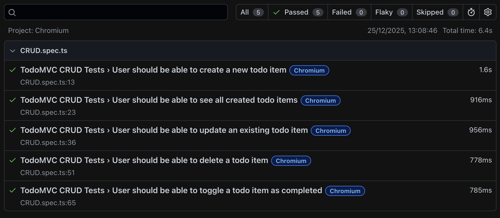

<h1 align="center">TodoMVC Playwright Automation</h1>

<p align="center">
  Automated E2E tests for <a href="https://demo.playwright.dev/todomvc/#/">TodoMVC</a> using Playwright + TypeScript with Page Object Model, Faker-generated tasks, cross-browser execution, and CI/CD-ready configuration.
</p>

***

<p align="center">
  <a href="#features">FEATURES</a> |
  <a href="#structure">STRUCTURE</a> |
  <a href="#setup">SETUP</a> |
  <a href="#built-with">BUILT WITH</a> |
  <a href="#license">LICENSE</a>
</p>

***

## Features
- **CRUD tests**: Create, Read, Update, Delete todo items
- **Cross-browser**: Chromium, Firefox, WebKit
- **ESLint + Prettier** for code style
- **Husky pre-push hook** to prevent pushing lint errors
- **CI/CD ready**: GitHub Actions workflow
- **Playwright HTML Reporter** for detailed test results

<div align="center">

</div>

## Structure
- `.github/` – CI/CD workflows
- `pages/` – Page Object Model classes
- `tests/` – Test specs
- `.eslintr.mjs` – ESLint config
- `.prettierrc` – Prettier config
- `playwright.config.ts` – Playwright configuration
- `.env` – Environment variables like `BASE_URL`
- `package.json` – Scripts and dependencies

## Setup
### 1. Precondition
- [Node.js & npm](https://nodejs.org/)
- Install dependencies:

```bash
npm install
```

### 2. Environment variables
- Create a `.env` file in the project root with the following content:
```
BASE_URL=https://demo.playwright.dev/todomvc
```
### 3. Running tests
- Run all tests: `npx playwright test --project=Chromium`
- Run a single test file: `npx playwright test tests/CRUD.spec.ts --project=Chromium`
- Run tests in headed mode (with browser UI): `npx playwright test --headed --project=Chromium`
- Generate HTML report after tests: `npx playwright show-report`

## Built With
- [TypeScript](https://www.typescriptlang.org/) – used to write automation test cases.
- [Playwright](https://playwright.dev/) – automation framework for browser interactions and E2E tests.
- [Faker.js](https://fakerjs.dev/) – generates random task names for testing uniqueness.
- [ESLint](https://eslint.org/) – static code analysis and linting.
- [Prettier](https://prettier.io/) – code formatting to enforce style consistency.
- [Husky](https://typicode.github.io/husky/#/) – pre-push Git hooks to prevent lint errors from being pushed.

## License
```
MIT License

Copyright (c) 2025 Yevhenii Marchenko

Permission is hereby granted, free of charge, to any person obtaining a copy
of this software and associated documentation files (the "Software"), to deal
in the Software without restriction, including without limitation the rights
to use, copy, modify, merge, publish, distribute, sublicense, and/or sell
copies of the Software, and to permit persons to whom the Software is
furnished to do so, subject to the following conditions:

The above copyright notice and this permission notice shall be included in all
copies or substantial portions of the Software.

THE SOFTWARE IS PROVIDED "AS IS", WITHOUT WARRANTY OF ANY KIND, EXPRESS OR
IMPLIED, INCLUDING BUT NOT LIMITED TO THE WARRANTIES OF MERCHANTABILITY,
FITNESS FOR A PARTICULAR PURPOSE AND NONINFRINGEMENT. IN NO EVENT SHALL THE
AUTHORS OR COPYRIGHT HOLDERS BE LIABLE FOR ANY CLAIM, DAMAGES OR OTHER
LIABILITY, WHETHER IN AN ACTION OF CONTRACT, TORT OR OTHERWISE, ARISING FROM,
OUT OF OR IN CONNECTION WITH THE SOFTWARE OR THE USE OR OTHER DEALINGS IN THE
SOFTWARE.
```
